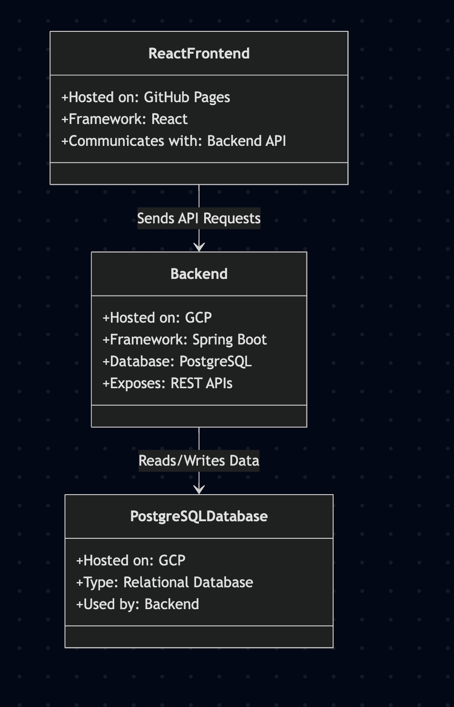
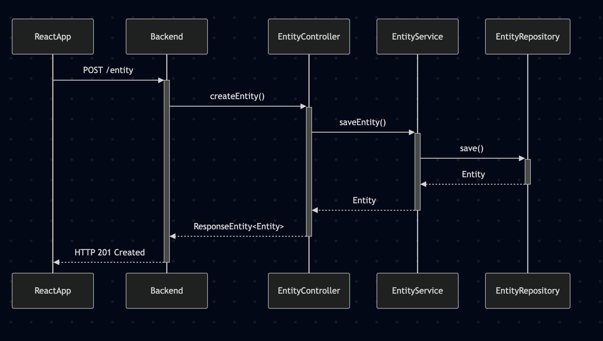
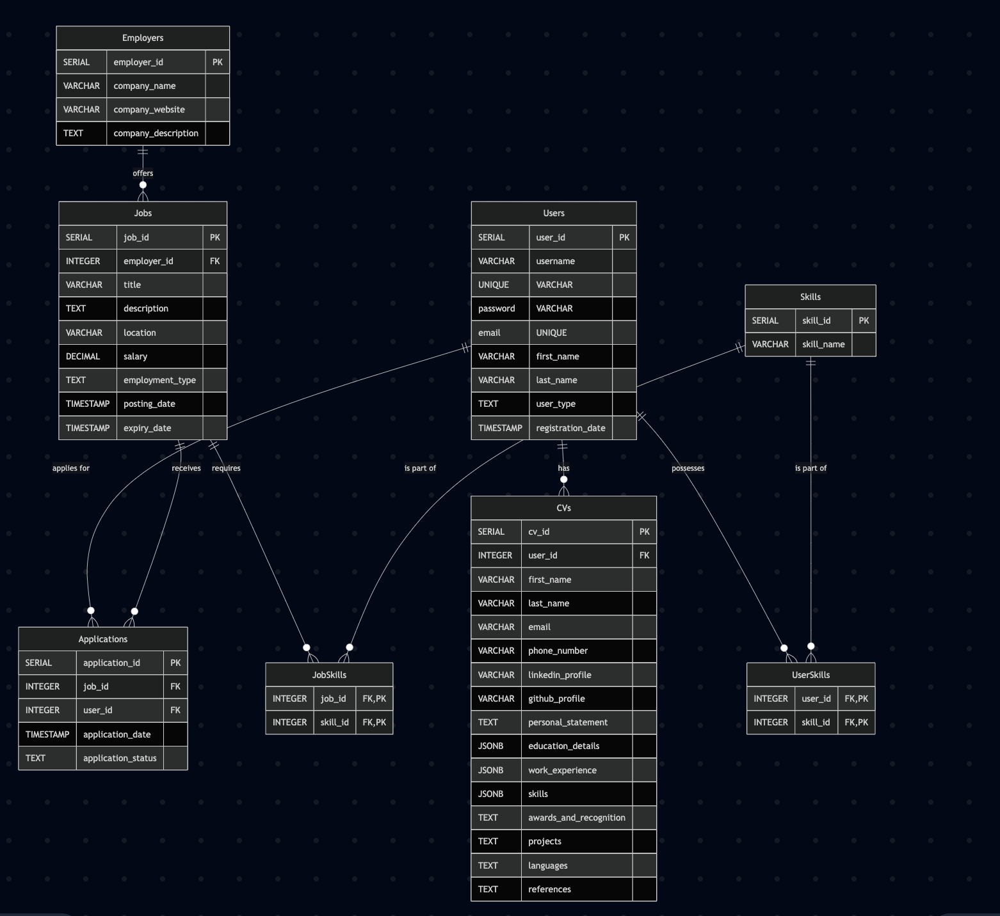

# Systems Modelling

## Table of Contents
1. [Introduction](#Introduction)
2. [Systems Models](#Systems-Models)
3. [UML Models](#UML-Models)
4. [System Architecture](#System-Architecture)
5. [Documentation and Explanation](#Documentation-and-Explanation)
6. [Conclusion](#Conclusion)
7. [References](#References)

## Introduction

This document aims to provide a detailed guide on how the systems modelling process that has gone behind the job search application.
The document aims to outline the architecture and implementation fo the system, with the designs of the application and how it will look being help in Designs.md file.
We aim to create a comprehensive job recruitment app that allows two sets of users, the first being the recruiter the second being a job-seeker.

The app aims to allow Recruiters to post jobs, look at metrics such as how many users applied and how many users viewed the job, as well as amend the job details if necessary.
Meanwhile, job-seekers can create a profile, store documentation like CV's and apply for job postings.

<<<<<<< Updated upstream
To meet the necessary complexity of the project the application will have a front end that is designed and created using React.JS in order to provide a dynamic and interactive interface that actively engages the users.

**Harry to do backend intro** 
=======
To meet the necessary complexity of the project the application will have a front end that is designed and created using React.JS in order to provide a dynamic and interactive interface that actively engages the users. With a spring boot backend hosted on GCP conected with a postgres database wich will also be hosted on GCP.
>>>>>>> Stashed changes

## Systems Models

### Overview
The systems models section is used to highlight how the application will connect job-seekers and recruiters together in a smooth and seamless manner.
These systems are made up of several complicated components and sections that need to work together in order to provide a flawless and immersive user experience while maintaining the key functionality.
To help explain the systems models, we split the models into three main categories, the first being the **Frontend**, the second being the **Backend**, and the third being the **Database**.
Each section will have a detailed explanation of how the system works and how it interacts with the other systems, why a certain framework or methodology was chosen, and how it will be implemented.

### Frontend:
The frontend side of this application is designed to be created using the React.js framework, often referred to as React. 
React is a javascript library developed by Meta, formally Facebook, in order to create dynamic, interactive and engaging user interfaces for websites using the Single Page Application (SPA) methodology.

An SPA is a web development methodology that dynamically rewrites the contents of a site instead of using the traditional method of redirecting a user to a new page (Codecademy, 2025).
The primary reason for picking React as the framework to develop the frontend was the ability to create an SPA. 
The benefits of an SPA are directly linked to the React framework, one of these benefits is the ability to create reusable components.
Components like buttons and forms can be reused in multiple aspects of the application which reduces the development time as well as increasing the efficiency of the application.

Although there are other frameworks like Vue.js and Angular.js that can also create SPAs, React was finally chosen due to the ease of use that it offers, the large amount of documentation, community support as well as being the current industry standard for web development.

<<<<<<< Updated upstream

## UML Models

## System Architecture

## Documentation and Explanation

## Conclusion

## References
```
Codecademy (2025) What is a SPA?, Codecademy. 
Available at: https://www.codecademy.com/article/fecp-what-is-a-spa 
(Accessed: 3 February 2025).
=======
### Backend:
The backend of this application is designed to be developed using the Spring Boot framework. Spring Boot is a Java-based framework that simplifies the development of robust and scalable backend systems by providing pre-configured setups and reducing boilerplate code.

Spring Boot was chosen for this project due to its ability to create RESTful APIs efficiently, which are essential for enabling communication between the frontend and the backend. The framework also supports seamless integration with various databases, making it an ideal choice for connecting to the PostgreSQL database used in this application.

One of the key advantages of Spring Boot is its built-in dependency management and auto-configuration features, which significantly reduce development time. Additionally, it offers excellent scalability, allowing the application to handle increased traffic and data as the user base grows. 

While other backend frameworks like Django (Python) and Express.js (Node.js) were considered, Spring Boot was selected due to its strong support for enterprise-level applications, extensive documentation, and active community. Furthermore, its compatibility with Google Cloud Platform (GCP) services ensures smooth deployment and hosting of the backend, aligning with the project's architecture.

The backend will handle critical functionalities such as user authentication, job posting management, application tracking, and data analytics. By leveraging Spring Boot, the backend ensures a secure, efficient, and scalable foundation for the application.
(Spring, 2019),(Google Codelabs, 2025),(postgresql, 2025)

## UML Models
### Overall Application


### In depth UML diagram


### ERD diagram


## System Architecture

The system architecture for this job recruitment application is designed to ensure scalability, reliability, and efficiency. It is divided into three main layers: **Frontend**, **Backend**, and **Database**, with the **Frontend** hosted on **GitHub Pages** and the **Backend** and **Database** hosted on the **Google Cloud Platform (GCP)** for seamless integration and deployment.

### 1. **Frontend**
- **Framework**: React.js
- **Purpose**: The frontend is responsible for providing a dynamic and interactive user interface for both recruiters and job-seekers. It uses the Single Page Application (SPA) methodology to ensure a smooth user experience.
- **Deployment**: The React.js application is hosted on **GitHub Pages**, which provides a simple and cost-effective way to serve static frontend files.
- **Communication**: The frontend communicates with the backend via RESTful APIs over HTTPS.

### 2. **Backend**
- **Framework**: Spring Boot
- **Purpose**: The backend acts as the core of the application, handling business logic, user authentication, job posting management, application tracking, and analytics.
- **Deployment**: The backend is deployed on **Google Cloud Run**, ensuring scalability and high availability.
- **API Design**: RESTful APIs are used to enable communication between the frontend and backend.
- **Security**: The backend implements secure authentication mechanisms and ensures data validation and protection.

### 3. **Database**
- **Database**: PostgreSQL
- **Purpose**: The database stores all application data, including user profiles, job postings, applications, and analytics data.
- **Deployment**: The PostgreSQL database is hosted on **Google Cloud SQL**, providing managed database services with automatic backups and scaling.
- **Data Relationships**: The database is designed with a relational schema to ensure data integrity and efficient querying.

### 4. **Hosting and Workflow**
1. **Frontend Hosting**: The React.js frontend is hosted on **GitHub Pages**, serving static files directly to users.
2. **Backend and Database Hosting**: The backend and database are hosted on **GCP**, leveraging its scalability and reliability.
3. **User Interaction**: Users (recruiters and job-seekers) interact with the application through the React.js frontend found https://uniofgreenwich.github.io/elee1149-coursework--accidental-experts/.
4. **API Requests**: The frontend sends API requests to the Spring Boot backend for operations like job posting, application submission, and user authentication.
5. **Data Processing**: The backend processes the requests, applies business logic, and interacts with the PostgreSQL database to retrieve or store data.
6. **Response**: The backend sends the processed data back to the frontend, which updates the user interface dynamically.

This architecture ensures a modular, scalable, and maintainable system that can handle the needs of both recruiters and job-seekers efficiently while leveraging the cost-effectiveness of GitHub Pages for frontend hosting.

## References
```
Reference list
Codecademy (2025). What is a SPA? [online] Codecademy. Available at: https://www.codecademy.com/article/fecp-what-is-a-spa.Google [Accessed 20 Jan. 2025].
Codelabs (2025). Spring Boot on Google Cloud Platform  |  Google Codelabs. [online] Google Codelabs. Available at: https://codelabs.developers.google.com/spring/ [Accessed 20 Jan. 2025].
postgresql (2025). PostgreSQL: Documentation. [online] www.postgresql.org. Available at: https://www.postgresql.org/docs/. [Accessed 20 Jan. 2025].
Spring (2019). Spring Projects. [online] Spring.io. Available at: https://spring.io/projects/spring-boot. [Accessed 20 Jan. 2025].
>>>>>>> Stashed changes
```